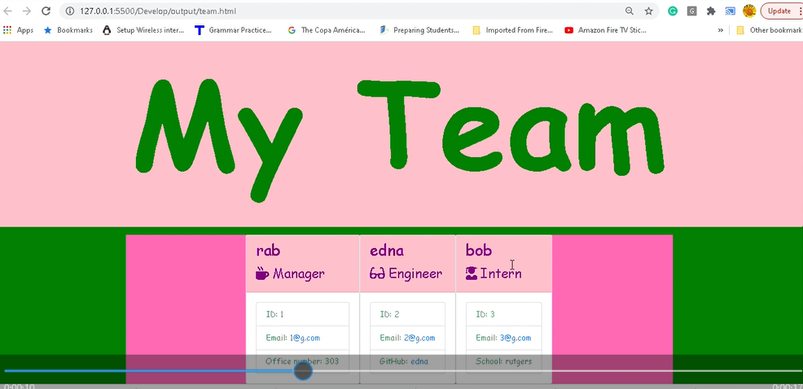

# Unit 12 Homework: Employee Tracker
  

  
 ## Table of Contents
  
* [Description](#Description)
  
* [Installation](#Installation)
  
* [Usage](#Usage)
  
* [License](#License)
  
* [Contributors](#Contributors)
  
* [Questions](#Questions)
  
 ## Description 
  
Developers are often tasked with creating interfaces  known as a Content Management System. CMS's make it easy for non-developers to view and interact with information stored in databases.  In this interface I created and built a solution for managing a company's employees using node, inquirer, and MySQL.

 

 ## Installation
  
 💾 
  
* npm init
  
* npm install express
* npm install inquirer
    
 ## Usage
 

 This  Functional command-line application allows the users to:

  * Add departments, roles, employees

  * View departments, roles, employees

  * Update employee roles

 
 
LANGUAGES USED ARE:
 

- HTML
- CSS
- JAVASCRIPT
- NODE.JS

How do you deliver this?:

* Use the [MySQL](https://www.npmjs.com/package/mysql) NPM package to connect to your MySQL database and perform queries.

* Use [InquirerJs](https://www.npmjs.com/package/inquirer/v/0.2.3) NPM package to interact with the user via the command-line.

* Use [console.table](https://www.npmjs.com/package/console.table) to print MySQL rows to the console. There is a built-in version of `console.table`, but the NPM package formats the data a little better for our purposes.
  

 ## License
 To view the license click [here](https://choosealicense.com/licenses/mit/)

  
 ## Contributors
  
 Contributions are accepted. Feel free to fork.
1. Fork it
2. Create your feature branch (git checkout -b feature/fooBar)
3. Commit your changes (git commit -am 'Add some fooBar').
4. Push to the branch (git push origin feature/fooBar)
5. Create a new Pull Request# RfHogans

  
  
 ## Questions
  
 If you want have any additional questions, you can reach me at
  
 **Github**: https://github.com/rabiahfh
  
 **Email**: hogansrabiah@gmail.com

``